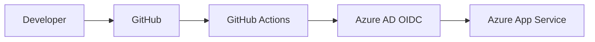

# Azure App Service CI/CD (Flask) — GitHub Actions + OIDC

Deploy a **Python Flask** app to **Azure App Service** using **GitHub Actions** with **OIDC (federated identity)**.

**Recruiter summary (what this demonstrates):**
- Secure CI/CD without long-lived publish profiles
- Azure identity + federated credentials (OIDC)
- Repeatable deployment pipeline + basic checks

## Architecture



## Repo structure

```
.
├── app.py
├── requirements.txt
├── runtime.txt
└── .github/workflows/deploy.yml
```

## How to use

### 1) Create the Azure Web App

Create an App Service (Linux) with Python runtime.

### 2) Create an Entra ID app + federated credential (OIDC)

Create a service principal with Contributor on the target resource group/subscription, then create a federated credential for this repo branch.

### 3) Configure GitHub repository settings

Set **Repository Variables**:
- `AZURE_WEBAPP_NAME` (example: `my-flask-app-prod`)

Set **Repository Secrets**:
- `AZURE_CLIENT_ID`
- `AZURE_TENANT_ID`
- `AZURE_SUBSCRIPTION_ID`

### 4) Push to main

Every push to `main` triggers deployment via `.github/workflows/deploy.yml`.

## Security

- No credentials are committed to the repository.
- Uses GitHub OIDC for Azure login.

## Troubleshooting

- OIDC login failures usually mean the **federated credential** subject/branch doesn’t match.
- Check the Actions logs for the failing step.
* Azure cloud automation
* Production-ready practices

It is ideal for:

* DevOps Engineers
* Cloud Engineers
* Azure Developers

---

## 🙌 Author

Sourabh Bhoyar
DevOps Engineer

---

If you find this helpful, please ⭐ the repository!
